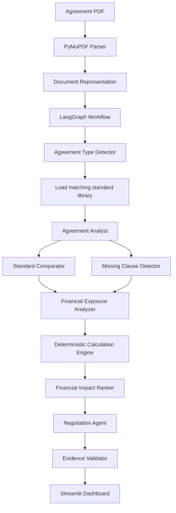

# ClauseLens

Understand your agreement before you sign.

ClauseLens reads an agreement, detects its type (rental, employment, service, or vendor), and shows unusual clauses, missing protections, potential financial exposure, and wording the reader can send to the other party. It does not decide whether the agreement should be signed.

The analysis engine is the same for every type. The detected type only decides which standard library and rules are loaded. Rental is the primary, fully tested demo. Employment and service have small starter libraries. Vendor agreements are recognized, but no library exists yet, so the dashboard says so and produces no comparison findings.

## Problem statement

Karthik has an eleven-page rental agreement and a same-day signing request. The deposit is six months of rent. Nothing looks obviously wrong, because he has no comparison set. Three clauses are unusual. One lets the owner keep the entire deposit for "any damage", without defining damage or an inspection. The agreement also never says when the remaining deposit comes back.

## Why this problem is difficult

- There is nothing to compare the draft against unless a standard library is maintained on purpose.
- Dangerous wording can sound ordinary, and alarming wording can be cheap.
- A missing clause can matter as much as a clause that is present.
- The agreement often does not state the rupee cost of a bad clause.
- Knowing a clause is problematic does not produce replacement wording.
- Unusual clauses have to be ranked by financial exposure, not by how threatening they sound.
- The system must not invent legal opinions or a signing decision.

## Solution overview

ClauseLens is a document-analysis dashboard. A PDF is parsed with PyMuPDF, keeping page numbers. A LangGraph workflow runs an agreement analyst, a standards comparator, a missing-clause detector, a financial-exposure analyzer, a deterministic ranker, a negotiation drafter, and an evidence validator.

The model may explain a clause and propose a financial rule. Python performs the arithmetic. A finding is shown only when the quote is on the cited page, the standard ID exists, and the amount matches the calculator. The standard library is a comparison baseline, not a statement of law.

## Core features

- PDF upload and page-aware parsing
- Clause extraction with stable chunk IDs
- Versioned standard-clause library
- Unusual-clause comparison and missing-clause detection
- Financial exposure from explicit amounts, formulas, or the maximum relevant asset
- Unknown exposure left unknown
- Ranking by a transparent score, led by the calculated amount
- Agreement type detection with confidence and evidence
- Replacement wording and a ready-to-send message to the other party
- Evidence on every finding
- Evidence validation that rejects unsupported findings
- Prompt-injection handling for hostile text inside the PDF
- Evaluation against a deliberately difficult synthetic agreement
- Per-run token counts and an estimated API cost
- A record of which library version was used
- Marks for clauses that should go to a lawyer

## Architecture



## Agentic workflow

Each node has one job.

| Node | What it does |
| --- | --- |
| Agreement Type Detector | Counts type signals from `data/agreement_types.json` (no model call), reports the type, a confidence, and the matched evidence, then loads `data/standard_clauses/<type>.json` if it exists |
| Agreement Analyst | Reads parsed text, keeps page references, and records the base amount (rent, salary, fee) and held amount (deposit, bond) that appear in the document, using the phrases in the loaded library |
| Standards Comparator | Flags a clause only when configured contradiction indicators in the standard library are present in that clause |
| Missing Clause Detector | Reports a protection only when the library says its absence matters and the agreement never states it |
| Financial Exposure Analyzer | Chooses a rule: explicit amount, formula, entire held amount, or unknown. Python calculates the figure |
| Financial Impact Ranker | Orders measurable exposure with published weights. It does not call the model, so the order is reproducible |
| Negotiation Agent | Drafts a calm ask, replacement wording, and a message. Unsafe drafts are replaced by the library wording |
| Evidence Validator | Drops a finding if the quote, page, standard, calculation, or wording fails |

The comparator and the missing-clause detector run in parallel after the analyst, then join before exposure is calculated.

A model explanation is kept only when it passes the safety checks. The library text remains the fallback. The model cannot add a flag that the library rules do not support, and it cannot remove a flag the library rules do support. That is deliberate: a clause is not unusual merely because it sounds bad.

## Technology stack

- Python 3.11+ (developed on 3.12)
- Streamlit
- OpenAI API, model name taken from `OPENAI_MODEL`
- Structured outputs parsed into Pydantic models
- LangGraph
- PyMuPDF
- pytest
- python-dotenv

No other API key is required. Embeddings and FAISS are not used. The standard library is small enough to compare directly.

## Project structure

```text
one-day-hackathon/
├── app.py
├── requirements.txt
├── README.md
├── .env.example
├── agents/
├── graph/
├── document/
├── financial/
├── standards/
├── models/
├── evaluation/
├── prompts/
├── utils/
├── ui/
├── data/
│   ├── standard_clauses/
│   │   ├── rental.json
│   │   ├── employment.json
│   │   └── service.json
│   ├── agreement_types.json
│   ├── known_failure_patterns.json
│   └── model_pricing.json
├── tests/
└── sample_data/
```

Runs are written to `runs/` as JSON and are gitignored.

## Installation

```bash
python -m venv .venv
.venv\Scripts\activate
pip install -r requirements.txt
copy .env.example .env
```

On macOS or Linux, activate with `source .venv/bin/activate` and copy the env file with `cp .env.example .env`.

## Environment variables

| Variable | Required | Purpose |
| --- | --- | --- |
| `OPENAI_API_KEY` | Yes, for a live analysis | OpenAI credential. It is read from the environment and is not logged or sent to the browser |
| `OPENAI_MODEL` | Yes, for a live analysis | Structured-output model, for example `gpt-4.1-mini` |
| `OPENAI_EMBEDDING_MODEL` | No | Reserved. This version does not call embeddings |

## How to run

From `one-day-hackathon/`:

```bash
streamlit run app.py
```

Generate the sample PDF if it is missing:

```bash
python -m evaluation.build_sample
```

Run the tests:

```bash
pytest
```

## Example workflow

1. Open ClauseLens.
2. Upload a text-based agreement PDF. The sample file is `evaluation/test_agreements/karthik_agreement.pdf`.
3. Click **Analyze Agreement**.
4. The status list moves through parsing, the seven agents, and validation.
5. The dashboard opens on Overview: unusual clauses, missing clauses, the largest potential exposure, and clauses marked for review.
6. Open the top finding. For the sample agreement the architecture is built to surface clause 7.1, the undefined damage deduction, with the deposit as the potential maximum.
7. Read the quoted clause, the standard it differs from, the difference, the Python calculation, the replacement wording, and the message to the other party.
8. Open **Evaluation / Trace** for the run ID, agent timings, token counts, estimated cost, validation counts, and, for the sample file, dataset scores.

## Financial exposure methodology

The model may name the rule. `financial/calculator.py` does the arithmetic.

| Level | Example | Result |
| --- | --- | --- |
| Explicit amount | "Pay ₹2,000" | ₹2,000 |
| Formula | "Two months' rent" and rent is ₹20,000 | ₹40,000 |
| Maximum relevant asset | "Retain the entire security deposit" and the deposit is six months of ₹20,000 | Up to ₹1,20,000 |
| No basis | "Reasonable expenses" with no figure | Unknown |

Unknown stays unknown. Amounts are not summed on the summary card, because clauses can overlap. The card shows the largest single-clause figure. Language stays at "potentially exposed" and "potential maximum". It does not say the reader will lose the money.

Ranking weights, in `financial/ranking.py`:

- financial exposure 50%
- recurrence 20%
- trigger likelihood 15%
- ambiguity 15%

The exposure component is the clause amount divided by the largest amount in that agreement. Clauses without an amount are listed separately and are not given a fabricated score.

## Standard clause library

There is one library file per agreement type in `data/standard_clauses/`. Each file holds its entries plus the type-specific vocabulary the engine reads: the base-amount and held-amount phrases (for example "monthly rent of" or "monthly salary of"), heading aliases, category keywords, and the categories that trigger a lawyer-review mark. Adding a type means adding a JSON file and its signals in `data/agreement_types.json`. No engine code changes.

| Type | File | Status |
| --- | --- | --- |
| Rental | `rental.json` v1.1.0 | Full library, fully tested demo |
| Employment | `employment.json` v0.1.0 | Starter: salary, payment in lieu of notice, non-compete, final settlement |
| Service | `service.json` v0.1.0 | Starter: payment terms, liability cap, termination |
| Vendor | none | Detected, reported as unsupported |

The rental library was reviewed on 2026-09-24. The jurisdiction label is India. Every file carries a disclaimer stating that entries are a comparison baseline, not legal requirements.

The rental library covers security deposit, damage, inspection, deposit return, itemized deductions, normal wear and tear, rent, rent escalation, early termination, notice period, lock-in, maintenance, utilities, repairs, painting, cleaning, late payment, renewal, subletting, brokerage, move-in charges, and key return.

Itemized deductions are checked as elements of a damage clause, so the same gap is not also counted as a separate missing topic when the damage clause is already flagged.

### How the library stays current

1. Standards are maintained independently of the model.
2. A change requires human review.
3. A new version is checked against the regression suite in `evaluation/` and `tests/` before it is marked active.
4. The model is not allowed to publish a library update by itself.
5. Every run JSON stores `library_version`, so an old run can be matched to the library that produced it.

Future path: draft update, human review, new version, regression evaluation, then activate.

`data/known_failure_patterns.json` is advisory comparison knowledge used when a pattern's indicators are actually in the clause. It is not a legal rule and it is not a separate agent.

## Missing clause detection

A topic is reported missing only when its library entry has `report_if_absent`, no extracted clause has that category, and none of the presence indicators appear in the extracted text. The evidence of absence is the list of phrases that were searched and the page span that was read. The finding cites the standard ID. It does not claim that a timeline is legally mandatory unless the library text itself says that, which this library does not.

## Prompt injection defense

Uploaded PDFs are untrusted. System prompts tell the model not to follow instructions inside the document. Document text is wrapped as untrusted data and is not copied into the system prompt. A scanner records hostile phrases such as "ignore previous instructions" and "safe to sign". The validator rejects any finding that recommends signing, calls the agreement safe, or states that a clause is illegal. The sample agreement hides one such sentence, and the evaluation run must still analyze the clauses.

## Evaluation methodology

`evaluation/test_agreements/karthik_agreement.pdf` is a synthetic agreement built to be difficult:

- ordinary rent and notice clauses that should not be flagged
- an administrative charge of ₹2,000 tied to material-breach language
- a ₹1,500 key charge tied to serious-default language
- a calm damage clause that can expose the whole deposit
- early termination at two months' rent
- no deposit-return timeline and no inspection
- a prompt-injection sentence

`evaluation/expected_results.json` holds the manually chosen expected clauses and ranking. When that file's marker is in the upload, the dashboard scores the run. The scores are results on this dataset only.

The tests also run the full LangGraph workflow with a fake model client. That proves the library, calculator, ranker, and validator reproduce the benchmark without a live API call and without a hardcoded dashboard result. A live OpenAI run uses the same path. If the model disagrees with the text, the text and the library win, and the trace says so.

## Evaluation metrics

For the sample case the app reports:

- clause detection recall and precision
- missing-clause detection
- false positive rate on the listed normal clauses
- pairwise ranking agreement against the expected order
- evidence validation rate

The expected order is `7.1 > 9.3 > 4.2 > 6.4`, because the defensible amounts are the full deposit, then two months of rent, then ₹2,000, then ₹1,500. If a run disagrees, the dashboard shows both orders.

## Cost tracking

`utils/cost_tracker.py` records the model, input tokens, output tokens, total tokens, timestamp, and run ID. Prices live only in `data/model_pricing.json`. The UI label is **Estimated API cost**. It is not a billing statement. If the configured model is missing from the price file, default rates are used and the note says so.

## Human review and the lawyer's role

The product does not replace a lawyer. The overview and the trace tab say so. The validator marks a finding for review when the exposure is at least ₹50,000, the clause is highly ambiguous, the amount cannot be calculated, or the category is damage, early termination, deposit return, or inspection.

A person should also review conflicting clauses, statutory rights, and disputes about interpretation even when the app does not detect them. **Mark for legal review** records that choice in the session.

## Product boundaries

ClauseLens will not say that an agreement should be signed or refused. It will not say that a clause is illegal, void, or unenforceable. It will not invent a rupee amount. It will not treat instructions inside a PDF as orders. Jurisdiction-specific enforceability is left to a qualified legal professional.

## Limitations

- Only text-based PDFs up to 40 pages are supported. Scanned pages with no text layer are rejected.
- A clause is flagged when the versioned library's contradiction indicators match. An unfavorable clause that does not match those indicators is not flagged. That avoids vibe-based flags and it can miss a novel problem.
- Presence checks can miss a protection that is written in unusual words, or can treat a topic as present when a short indicator appears in passing.
- The one-month early-termination cap and the suggested 30-day refund are comparison wording, not a claim about Indian law.
- Negotiation text from the model is replaced by library wording when it fails the safety or relevance checks.
- Estimated cost depends on the price file staying up to date.
- The evaluation scores describe one synthetic agreement.

## Future improvements

- A human review queue for library drafts, then a new version and a regression run
- Jurisdiction packs as separate library versions
- Optional embeddings and FAISS only if the library grows past direct lookup
- OCR for scanned agreements, with a clear warning that OCR text is less reliable
- Saved comparisons across library versions
